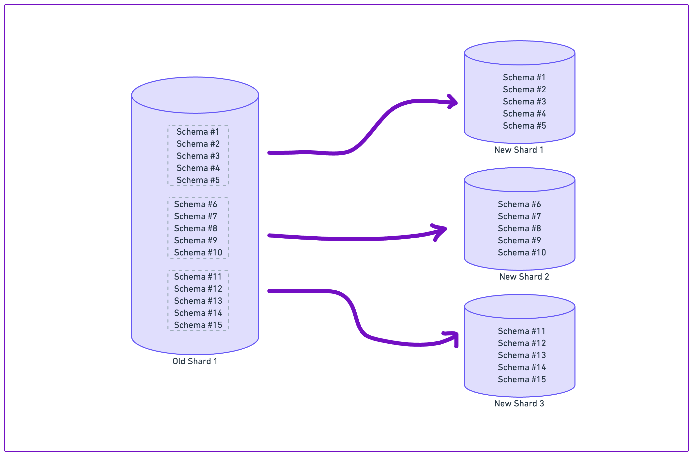
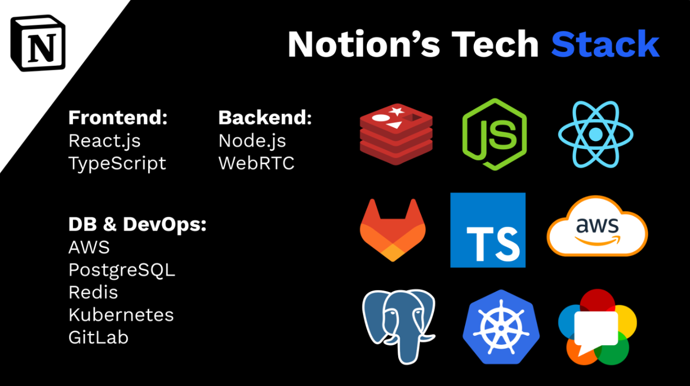

# Notion: Análise arquitetural do sistema

**Notion** \
<small>by Notion Labs Inc</small> \
<small>Lançado em 2016 </small> \
Suportado em `Windows`, `macOS`, `Android`, `iOS`, `Linux`, `Navegadores Web`

Notion é um software de produtividade que permite aos usuários combinar notas, tarefas, wikis e bancos de dados em um único lugar. É usado para organizar projetos pessoais ou de trabalho, tomar notas, criar listas de tarefas, gerenciar equipes e muito mais.

As principais funcionalidades do Notion incluem a capacidade de criar e editar notas, listas de verificação, tabelas e quadros Kanban. Ele também oferece modelos personalizáveis, permitindo que os usuários criem páginas que se adequem às suas necessidades específicas. Além disso, o Notion suporta colaboração em tempo real, permitindo que várias pessoas trabalhem no mesmo projeto simultaneamente.

## Caracterizção

### Influências sobre a decisão arquitetural

* **Número de acessos simultâneos:**
  Foi preciso considerar no projeto do Notion a grande carga de acessos simultâneos esperados e meios de otimizar a performance diante desse desafio. Para isso, é necessário a implementação de balanceamento de carga e estratégias como 're-sharding' para distribuir a carga no banco de dados.

  
* **Número de clientes:**
  À medida que a base de usuários cresce, o sistema precisa ser capaz de escalar de forma eficaz para lidar com o aumento do tráfego e dos requisitos de armazenamento de dados. Para isso, a implementação de uma arquitetura de microsserviços em nuvem permite escalabilidade vertical de partes independentes do sistema conforme necessário.
  
* **Requisitos de segurança:**
  O Notion lida com dados confidenciais do usuário e, portanto, precisa ser projetado medidas de segurança da informação. O uso de criptografia para dados armazenados e em trânsito e a implementação de mecanismos seguros de autenticação e autorização são estratégias utilizadas para reduzir vulnerabilidades.

## Descrição geral da arquitetura
O sistema do Notion foi projetado para ser flexível e adaptável a uma variedade de usos, desde o gerenciamento de projetos até a organização de tarefas pessoais e profissionais.

A arquitetura é baseada em um modelo de dados relacional, que permite a criação de diferentes tipos de conteúdo (como texto, imagens, listas de verificação, etc.) e a relação entre eles. Isso é feito através de "blocos", que são as unidades básicas de conteúdo no Notion. Cada bloco pode conter outros blocos, permitindo a criação de estruturas complexas e hierárquicas de conteúdo.

Além disso, um aspecto importante da arquitetura do Notion é a sua API, que permite a integração com outras ferramentas e serviços. A API do Notion usa o protocolo HTTP e o formato de dados JSON, padrões amplamente utilizados na web.

Em termos de tecnologias utilizadas, o Notion é construído principalmente utilizando várias bibliotecas e frameworks JavaScript, incluindo React e Redux.

### Histórico do sistema
...

### Decisões de projeto
...

### Tech stack

# Tech Stack Overview

## Linguagens e Frameworks 

- **Node.js**: Ambiente de execução JavaScript server-side.
- **Next.js**: Framework React para desenvolvimento web.
- **JavaScript**: Linguagem de programação amplamente utilizada para desenvolvimento web.
- **Python**: Linguagem de programação versátil, usada em diversas áreas como ciência de dados e desenvolvimento web.
- **HTML5**: Linguagem de marcação padrão para criação de páginas web.
- **CSS 3**: Linguagem de estilo para descrever a apresentação de documentos HTML.
- **Kotlin**: Linguagem de programação moderna e estática usada principalmente para desenvolvimento Android.
- **Swift**: Linguagem de programação desenvolvida pela Apple para desenvolvimento de aplicativos iOS.
- **TypeScript**: Superconjunto de JavaScript que adiciona tipagem estática ao código.

## Development

- **Babel**: Transpilador JavaScript que permite usar a próxima geração de JavaScript, hoje.
- **Webpack**: Empacotador de módulos JavaScript.
- **AWS Elastic Load Balancing**: Serviço que distribui automaticamente o tráfego de aplicativos por várias instâncias.
- **Docker**: Plataforma para desenvolver, enviar e executar aplicativos em contêineres.

## Libraries

- **React**: Biblioteca JavaScript para construção de interfaces de usuário.
- **jQuery**: Biblioteca JavaScript que simplifica manipulação de HTML, eventos e animações.
- **Moment.js**: Biblioteca JavaScript para manipulação e formatação de datas.
- **Lodash**: Biblioteca JavaScript que fornece utilitários para tarefas de programação comuns.

## Hosting

- **Amazon EC2**: Serviço da AWS que fornece capacidade de computação escalável na nuvem.
- **Amazon Web Services (AWS)**: Plataforma de serviços de computação em nuvem da Amazon.

## Data Stores

- **Apache Spark**: Motor de processamento de dados para análise em tempo real.
- **Apache Flink**: Plataforma de processamento de fluxo de dados.
- **Amazon S3**: Serviço de armazenamento de objetos escalável.
- **dbt**: Ferramenta para transformação de dados no fluxo de trabalho de ETL.
- **PostgreSQL**: Sistema de gerenciamento de banco de dados relacional e objeto-relacional.
- **Memcached**: Sistema de cache distribuído.
- **Hadoop**: Framework para processamento de grandes conjuntos de dados.
- **Kafka**: Plataforma de streaming de eventos.
- **Airflow**: Plataforma para criar, agendar e monitorar fluxos de trabalho.

## Referências
**Arka Ganguli, Tanner Johnson, Ben Kraft, Nathan Northcutt**.
The Great Re-shard: adding Postgres capacity (again) with zero downtime. Disponível em [https://www.notion.so/blog/the-great-re-shard].

**Himalayas app Notion tech stack**
Discover the tools and technologies used to build Notion's products and services. Disponível em [https://himalayas.app/companies/notion/tech-stack]

**Michael slashdev**
Breaking down Notion Tech Stack.  Disponível em [https://slashdev.io/-breaking-down-notions-tech-stack]

**Jake Teton-Landis**.
The data model behind Notion's flexibility. Disponível em [https://www.notion.so/blog/data-model-behind-notion].

